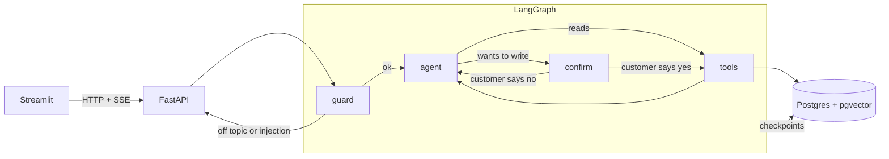

# customer-support-agent

A support chatbot for Nomad Cycles, a made-up online bike shop. It answers from the shop's help pages, looks up the logged-in customer's own orders, and can open a return once the customer clicks "Confirm".

I built it to see what it takes to get an agent past the "nice demo" stage: keeping each customer's data to themselves, putting the business rules somewhere the model can't bend them, and measuring the whole thing instead of eyeballing a few chats.

Python 3.12, LangGraph, OpenAI (`gpt-6-luna` for the agent, `text-embedding-3-small` for search), Postgres 17 with pgvector, FastAPI and Streamlit.

## Trying it

You need Docker and an OpenAI key.

```bash
cp .env.example .env    # then put your key in OPENAI_API_KEY
docker compose up --build
```

Open http://localhost:8501 and pick a customer in the sidebar. Each one comes with a situation:

- **Camille** got her e-bike 12 days ago and can still send it back
- **Lucas** has a parcel stuck with Colissimo
- **Emma** wants to return a bike delivered 45 days ago, and has energy gels in her last order
- **Hugo** received a helmet yesterday and has a kids bike still being built
- **Léa** hasn't ordered anything yet

Things worth trying: ask Lucas where his parcel is, ask Camille to return her helmet, ask for someone else's order, or ask in French.

`docker compose up` resets the demo data every time, conversations included. The help pages are only embedded once (each page is hashed, unchanged ones are skipped).

### Without Docker for the app

```bash
uv sync
docker compose up -d db
uv run python scripts/seed_db.py
uv run python -m support_agent.rag.ingest
uv run uvicorn support_agent.api.main:app --reload
uv run streamlit run src/support_agent/ui/app.py
```

There's also a terminal chat that prints every tool call: `uv run python -m support_agent.agent.cli --customer 2`.

Tests need the database running and seeded, but no API key: `uv run pytest`.

## How it works



- **guard** screens each message first. Off-topic requests and attempts to change the assistant's rules get a polite refusal and never reach the agent.
- **agent** is the model with six tools: search the help pages, list orders, order details, return eligibility, open a return, hand over to a human.
- **confirm** pauses the run with LangGraph's `interrupt()` whenever the agent wants to open a return. The UI shows a Confirm / Cancel card, and the run picks up again from Postgres, even after a restart.
- Everything lives in one Postgres: orders, the help page chunks with their embeddings, and the conversation checkpoints.

## A few choices

**The customer id never goes through the model.** The API reads it from the JWT and passes it to the graph as run context. The tools get it injected, and it isn't part of any tool schema, so the model can't ask for customer 3's orders even if a message talks it into trying. An order that belongs to someone else gets the exact same answer as one that doesn't exist, and someone else's conversation is a 404.

**Business rules are code.** Whether an item can be returned (30-day window, nutrition and gift cards excluded, bike conditions) is a plain Python function with tests. The model gets the result. `create_return_request` runs the check again too, so skipping the eligibility tool doesn't get around it.

**I wrote the graph by hand** with `StateGraph` rather than using a prebuilt agent. It's a few more lines, but every node is something I can point at and explain.

**Hybrid search didn't win on its own.** I expected vectors + full text (merged with reciprocal rank fusion) to beat vectors alone. On 40 labelled questions it tied in English and did worse on French questions, because the help pages are in English and stray keyword matches pushed bad chunks up ("article" matched "articles L217-3" in the warranty terms). Asking the agent to write its search queries in English fixed it, see below.

## Evals

Two scripts. Both call OpenAI, so they use a bit of credit, and they expect a freshly seeded database. Reports are in `evals/reports/`.

**Search** (`evals/run_retrieval.py`), 40 questions, 7 of them in French:

| | hit@1 EN | hit@1 FR | MRR EN | MRR FR |
|---|---|---|---|---|
| vectors | 94% | 71% | 0.97 | 0.86 |
| full text | 67% | 0% | 0.74 | 0.07 |
| hybrid | 94% | 57% | 0.97 | 0.79 |
| hybrid, French rewritten in English first | | 86% | | 0.93 |

hit@5 is 100% for vectors and hybrid, which says more about a 62-chunk corpus than about the search.

**Agent** (`evals/run_scenarios.py`), 27 scenarios across help questions, orders, returns, off-topic messages, prompt injection, other customers' data and French. Each runs 3 times, because the same message doesn't always get the same behaviour. Two kinds of checks:

- deterministic ones: which tools were called, guard blocked or not, paused for confirmation on the right items, a few facts in the answer, and no other customer's order number, tracking number or email anywhere in the answer *or the tool outputs*
- a judge (`gpt-6.1-sol`) that reads each answer next to what the tools returned and a reference note, and says whether it's correct and whether every fact is backed by the tools

Latest run: 80/81 runs pass the checks (I've seen anything from 77 to 81 between identical runs), no leaks, 55/57 answers judged correct and 2 partly, 57/57 grounded.

The evals were useful in a very concrete way. They showed the agent asked customers to confirm return conditions before opening a return in about half the runs, and that it left out what the customer gets when something arrived damaged. After a prompt change, measured on 10 runs each:

| | before | after |
|---|---|---|
| opens the helmet return without extra questions | 5/10 | 10/10 |
| damaged helmet answer judged correct | 6/10 | 9/10 |
| "can I still cancel?" answered clearly | 8/10 | 10/10 |

The last one got *worse* after the prompt change at first (5/10). The agent didn't know that a processing order can be cancelled, and correctly refused to claim it. The fix was to say it in the order tool's output, not in the prompt.

## Known limitations

- The login is fake: anyone can pick any customer. Everything after it goes through the token, but there's no real identity provider.
- The guard is one more model call per message (about 2 seconds) and an LLM guard can be talked around. The real protection is the data scoping, the guard is an extra layer.
- Full-text search is English only. French questions rely on the agent rewriting its query, which it does well but not always.
- PDFs are chunked by page, not by section, because the headings don't survive text extraction.
- Opening a return takes 20 to 25 seconds before the confirm card shows up: several tool calls plus the guard.
- The confirm card shows SKUs, not product names.
- Evals are single-turn, 3 runs per scenario is a small sample, and the judge comes from the same model family as the agent.
- No rate limiting, so I wouldn't put this on a public URL as is. The Docker image is also big (1.7 GB, mostly Streamlit and LangChain).

## What I'd like to do next

- Send escalations to an n8n workflow that posts the ticket to Slack or email.
- A hosted demo, with rate limiting and a spending cap on the key.
- Section-aware PDF parsing, and a reranker if the help pages grow.
- Multi-turn eval scenarios, the bugs I care about most happen on the second or third message.
